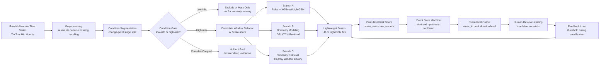
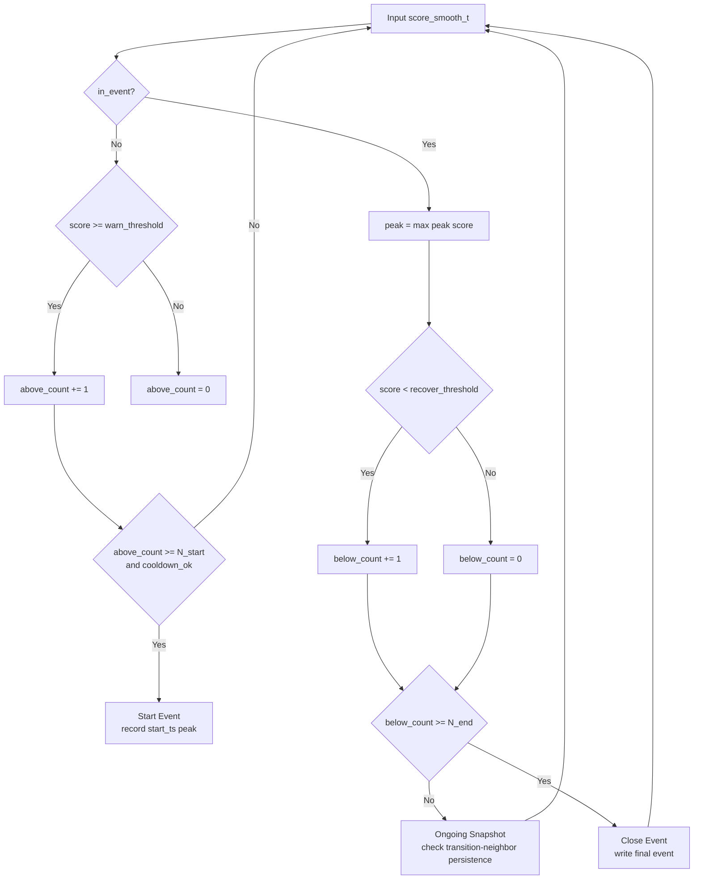
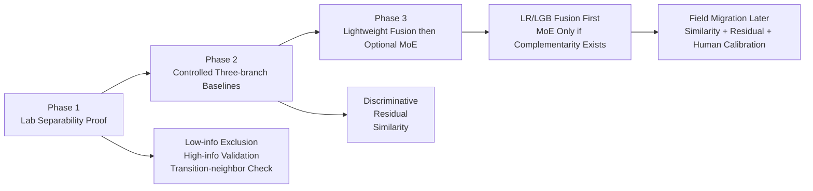

# 密封性异常检测复合模型架构图（论文风格）

> 说明：该图已按“实验室可分性优先”的路线重构。  
> 核心思想不再是全局统一分类，而是  
> **低信息工况排除 + 高信息工况优先 + 多分支基线 + 事件级融合判定**。

---

## Figure 1. Lab-first Overall Framework

---

## Figure 2. Transition-aware Event Logic

---

## Figure 3. Three-phase Roadmap

---

## 图注建议（可直接放论文）

- **Figure 1** 展示了实验室优先的总体框架：先做工况 gate，再对高信息窗口执行多分支建模，低信息工况不进入异常训练。
- **Figure 2** 给出事件级迟滞判定逻辑，并强调状态转移邻域要看持续抬升，而不是只看孤立峰值。
- **Figure 3** 明确三阶段路线：先证明可分性，再做受控三分支比较，最后才允许进入融合层和更复杂的 MoE。

---

## 路线约束（写给后续实现）

1. 低信息工况不是“效果差的数据”，而是当前阶段应显式排除的训练对象。  
2. `GRU` 预测残差分支保留，但只作为三分支之一，不再承担统一答案角色。  
3. 融合层默认从 `Logistic Regression` 或 `LightGBM` 开始。  
4. `MoE / Stacking / Boosting` 只有在至少两个分支存在互补性证据后才允许进入。  

---

## 可替换为论文术语的模块名（可选）

- Condition Gate → Condition-aware Exclusion and Routing
- Candidate Window Selector → Informative Window Mining
- Branch B (GRU/TCN Residual) → One-class Normality Modeling
- Lightweight Fusion → Early-stage Aggregation Layer
- Event State Machine → Temporal Hysteresis Decision Module
- Feedback Loop → Human-in-the-loop Continual Calibration
