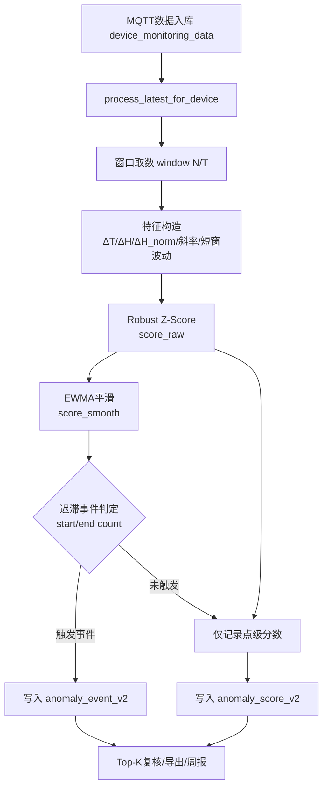
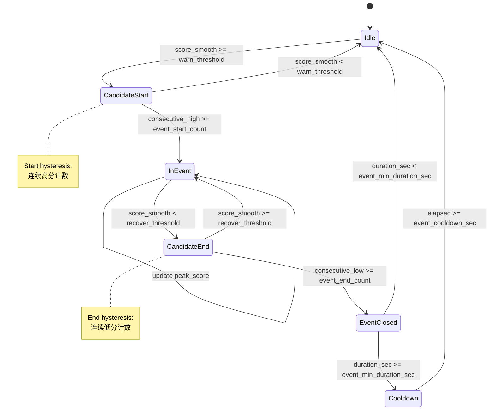

# 项目说明文档（业务与系统介绍）

> 项目名称：电机接线盒密封性异常检测系统  
> 更新时间：2026-03-09

---

## 1. 这是一个什么系统

这是一个面向设备运维场景的异常检测系统。  
系统会接收设备监测数据（温湿度等），结合模型推理判断设备是否存在密封性异常，并把结果实时展示给用户。

简单理解：
- 设备持续上报数据
- 系统自动检测是否异常
- 异常事件会被记录、展示、追溯

---

## 2. 系统解决什么业务问题

1. **实时发现异常**：运维人员能第一时间看到异常设备。
2. **降低漏检风险**：通过模型检测而不是纯人工巡检。
3. **支持追溯分析**：检测流水、异常事件、故障档案可回查。
4. **支持运维管理**：管理页可分页、筛选、排序、导出。

---

## 3. 核心业务流程

### 3.1 数据接入

- MQTT 程序 `reader.py` 接收设备消息。
- 数据写入 `device_monitoring_data`。

### 3.2 自动检测（已闭环）

- 数据入库后自动调用后端：
  - `POST /api/internal/process/{dev_num}/{device_timestamp}?queued=1`
- 后端通过“设备级合并队列 + 最小处理间隔”进行去抖与削峰。
- 后端构建检测窗口并调用模型服务。
- 结果写入 `detection_result_log`。
- 若判定异常，写入/更新 `anomaly_event`（同设备同小时只标一次），并归档到 `fault_archive`。

### 3.3 实时推送

- 通过 SSE 推送到前端（主页、诊断页）。

### 3.4 人工回放

- 诊断页可提交历史回放任务，对指定设备和时间范围补算检测结果。

---

## 4. 页面功能说明（给业务人员）

### 4.1 实时主页

- 展示后端状态、当前设备、检测状态。
- 实时曲线展示设备数据。
- 右侧设备轮播，异常高亮。
- 设备总数圆形组件：点击可查看设备ID及数据条数。

### 4.2 设备查询页

- 按设备号查询历史曲线。
- 展示异常标注。
- 可查看和设置设备级模型。
- 支持模型版本回滚。

### 4.3 管理页面

- 展示检测流水。
- 支持后端分页、状态筛选、设备号搜索、排序。
- 支持页码跳转和 URL 状态恢复（刷新保留条件）。

### 4.4 诊断测试页

- 实时诊断事件流。
- 故障档案筛选（设备号、时间范围）。
- 故障档案导出 CSV。
- 检测回放任务提交与进度查看。
- 运行指标查看（检测成功/超时/重试等）。

---

## 5. 关键数据表

1. `device_monitoring_data`：原始监测数据
2. `detection_result_log`：检测流水（每次检测结果）
3. `anomaly_event`：异常事件（按设备+小时去重）
4. `fault_archive`：故障专档（用于诊断与导出）
5. `device_model_preference`：设备级模型偏好

---

## 6. 关键接口（业务常用）

- 健康检查：`GET /api/health`
- 首页实时：`GET /api/home/current` / `GET /api/home/stream`
- 管理页列表：`GET /api/admin/recent`
- 设备统计与列表：`GET /api/device/stats` / `GET /api/device/ids`
- 故障档案：`GET /api/fault/recent` / `GET /api/fault/recent/export`
- 回放任务：`POST /api/diagnosis/replay` / `GET /api/diagnosis/replay/{task_id}`
- 内部触发：`POST /api/internal/process/{dev_num}/{device_timestamp}?queued=1|0`
- 运行指标：`GET /api/runtime/metrics`

---

## 7. 当前价值与边界

### 已具备

- 数据接入 → 自动检测 → 实时展示 → 异常归档 的完整闭环。
- 支持历史补算、故障导出、模型版本回滚。

### 当前边界

- 还未做权限体系（谁可看/可导出/可回放）。
- 还未做多租户隔离。
- 模型服务生产级治理可继续强化（监控、容量、熔断）。

---

## 8. 适合谁看

- **业务负责人**：看系统价值、流程与输出。
- **实施/运维**：看页面功能与操作入口。
- **研发**：看接口、表结构和运行机制。

---

## 9. 现场异常检测构想（实验室到现场迁移）

### 9.1 背景与挑战

当前数据条件：
- 实验室数据：1分钟采样、工况可控、具备“开孔/密封”标签。
- 现场数据：采样不均匀、跨度长、干扰因素多（胶泥影响、传感器偏移、环境变化）。

当前痛点：
- 直接使用 GRU、LightGBM 做单一二分类在现场效果不稳定。
- 时间轴不一致（等间隔 vs 不等间隔）导致时序模型泛化能力下降。
- 标签语义存在偏移（实验室“开孔”与现场“异常”不完全等价）。

### 9.2 目标定义

将目标由“单模型硬分类”调整为“实时异常评分 + 事件级告警判定”，提高现场稳定性、可解释性与可运维性。

### 9.3 技术路线（分层检测）

#### A. 特征层重构（优先级最高）

围绕“内外温湿度耦合”构建鲁棒特征，降低绝对值偏移影响：
- 差分特征：\(\Delta T=T_{in}-T_{out}\)、\(\Delta H=H_{in}-H_{out}\)
- 归一化特征：\(\Delta H/(|H_{out}|+\epsilon)\)
- 动态特征：斜率、二阶差分、短窗波动率
- 滞后耦合：cross-correlation 峰值与时滞
- 密封相关特征：湿度回落时间常数、恢复速率
- 采样质量特征：dt（间隔）、缺失率、静止段长度

#### B. 两阶段检测

1) 阶段一：在线异常打分（无监督/弱监督）
- 统计基线：Robust Z-Score + EWMA + CUSUM
- 在线模型候选：HalfSpaceTrees / Streaming IsolationForest（River）
- 输出连续 anomaly score

2) 阶段二：事件级告警判定（规则+轻量模型）
- 将 score 聚合为事件特征：峰值、持续时长、恢复时间
- 用 LightGBM/LogReg 做告警判定
- 引入迟滞（hysteresis）与最短告警间隔，抑制告警抖动

### 9.4 实验室知识迁移策略

实验室标签用于“初始化与约束”，而非直接替代现场真值：
- 特征筛选：验证哪些特征对密封异常最敏感
- 阈值初始化：以保守策略上线
- 告警策略校准：按可接受误报率逐步调参
- 主动学习闭环：人工复核高分事件并反哺模型

### 9.5 评估体系（从点级转为事件级）

建议核心指标：
- 事件级 Precision / Recall
- 误报率（次/天）
- 平均提前发现时间（lead time）
- PR-AUC（必要时引入 VUS-PR 作为补充）

### 9.6 落地节奏（2~4周）

- 第1周：特征重构 + 事件级评估框架
- 第2周：统计基线落地并接入现有主链路
- 第3周：在线模型 + 漂移检测（如 ADWIN）
- 第4周：现场复核闭环与阈值再校准

### 9.7 对当前系统的改造原则

- 保持现有主链路不变：数据接入 → 自动检测 → 实时推送 → 故障归档
- 新增“异常评分与事件聚合”层，不破坏既有接口契约
- 优先保证可解释和可运维，再逐步引入复杂模型

## 10. 当前进展与Baseline（2026-03-09）

### 10.1 当前已完成

1. 二期 v2 MVP 已打通：
   - 特征（`delta_t`、`delta_h`、`delta_h_norm`、`slope_delta_h`、`vol_5`）
   - 点级打分（Robust Z + EWMA）
   - 事件级迟滞（start/end count、最短时长、冷却时间）
   - 独立入库（`anomaly_score_v2`、`anomaly_event_v2`）

2. 二期联调能力已具备：
   - 运行时控制：`GET/POST /api/anomaly/v2/control`（已支持 `sim_enabled/sim_weight/sim_k`）
   - 对照分析：`GET /api/diagnosis/replay/compare`
   - 汇总与周报：`GET /api/anomaly/v2/shadow/summary`、`GET /api/anomaly/v2/report/weekly`
   - 漂移简版：`GET /api/anomaly/v2/drift/summary`
   - Top-K 复核：`GET /api/anomaly/v2/review/topk`、`GET /api/anomaly/v2/review/topk/export`

3. 回放验证已通过：
   - 已完成最近120点连续回放（成功处理）
   - `anomaly_v2_runs` 已增长，链路稳定

### 10.2 当前Baseline（已确定）

#### 算法Baseline（当前生产候选）

- 特征工程：物理先验 + 相对量 + 动态特征（MVP子集）
- 点级评分：`score_stat`（Robust Z-Score） + `score_sim`（历史窗口相似度）融合
- 融合方式：`score_final = (1-sim_weight)*score_stat + sim_weight*score_sim`
- 平滑：EWMA
- 事件判定：迟滞状态机（连续超阈启动、连续低阈结束）

#### 参数Baseline（保守档）

- `alpha=0.20`
- `warn_threshold=0.72`
- `recover_threshold=0.50`
- `min_points=5`
- `event_start_count=4`
- `event_end_count=6`
- `event_min_duration_sec=240`
- `event_cooldown_sec=900`
- `sim_enabled=false`（默认关闭，灰度启用）
- `sim_weight=0.30`
- `sim_k=5`

> 说明：当前“无事件”并不等于系统异常，而是该参数档位偏保守，需结合高波动样本或调低阈值验证事件触发能力。

## 11. 下一步需要做什么（按优先级）

### P0（本周必须）

1. 修复一期模型服务可用性（`process_model_error` 高），恢复 `MODEL_SERVICE_URL` 正常推理。
2. 完成人工复核首批样本（Top-30/天，累计≥100条）。
3. 基于复核样本输出首版事件级 Precision/Recall 与误报率。

### P1（本周/下周）

1. 做三档参数对照（保守/平衡/激进）并固化推荐参数。
2. 影子运行 24~72h，输出首版试点验收报告。
3. 将日报脚本纳入日常任务（JSON + CSV 自动归档）。

### P2（二期增强）

1. 接入 River 在线模型（并行于统计基线）。
2. 接入 ADWIN/等价漂移检测，支持漂移触发再校准。
3. 补齐高级特征（稳态偏移、5m/30m波动比、时滞耦合）。

## 12. 开源与文献“用在了哪一块”

### 12.1 已实际落地的参考

1. **TSB-AD（NeurIPS 2024）思想**
   - 用途：指导“先稳健基线、先评估闭环，再上复杂模型”的实施策略。
   - 落地点：当前先用统计基线 + 事件级评估，而非直接深度模型上线。

2. **Merlion（框架思路）**
   - 用途：作为离线横评方法池参考。
   - 落地点：日报/回放对照框架已搭好，后续可并入多算法横评。

3. **River（在线学习方向）**
   - 用途：流式场景在线异常检测与漂移自适应。
   - 落地点：已完成接口与流程预留，计划在 P2 并行接入。

### 12.2 尚未代码落地（但已纳入路线）

- TranAD、DAGMM：作为后续深度模型对照组，目前未进入主链路。

## 13. 配套文档

- 二期状态与验收：`docs/MVP实现状态报告.md`
- 统一技术文档：`docs/技术沉淀文档.md`
- 后续扩展清单：`docs/后续扩展TODO.md`
- 项目入口说明：`README.md`

## 14. 二期算法实现说明（流程+细节）

### 14.1 总体流程（文字版）

1. **数据进入**：MQTT 入库到 `device_monitoring_data`。
2. **触发检测**：后端 `process_latest_for_device` 读取窗口数据。
3. **特征构造**：计算内外温湿度差分、归一化、斜率、短窗波动等特征。
4. **点级打分**：使用 Robust Z-Score 计算异常分数 `score_raw`。
5. **平滑处理**：EWMA 平滑得到 `score_smooth`（抑制抖动）。
6. **事件判定**：迟滞状态机（连续超阈触发、连续低阈结束），生成事件。
7. **结果入库**：
   - 点级结果进入 `anomaly_score_v2`
   - 事件进入 `anomaly_event_v2`
8. **分析与汇总**：通过汇总接口、周报接口、日报脚本输出评估结果。

### 14.2 流程图（Mermaid）

### 14.3 事件状态机图（论文风格）

> 说明：该图对应当前二期实现中的“迟滞 + 最短时长 + 冷却期”机制。

### 14.4 特征与打分细节

- **核心特征**（MVP子集）：
  - `delta_t = in_temp - out_temp`
  - `delta_h = in_hum - out_hum`
  - `delta_h_norm = delta_h / (abs(out_hum)+eps)`
  - `slope_delta_h`（湿差斜率）
  - `vol_5`（短窗波动）

- **打分方式**：
  - 对特征做 Robust Z-Score（median/MAD）
  - 多特征 Z 值融合得到 `score_raw`
  - 使用 EWMA 得到 `score_smooth`

### 14.5 事件判定逻辑（迟滞）

- 连续 `event_start_count` 点 `score_smooth >= warn_threshold` → **事件开始**
- 连续 `event_end_count` 点 `score_smooth < recover_threshold` → **事件结束**
- 事件需满足：`event_min_duration_sec`
- 同设备事件间隔：`event_cooldown_sec`

### 14.6 工程化拆分（2026-03-09）

为降低 `backend_app.py` 臃肿度，已完成二期算法模块化拆分：

- `src/anomaly_v2/baseline.py`
  - 特征构造（`compute_features`）
  - 统计分数（`compute_stat_score`）
  - 相似窗口分数（`compute_similarity_score`）
  - 分数融合（`fuse_scores`）

- `src/anomaly_v2/state_machine.py`
  - 迟滞事件状态机（`update_event_state`）

- `src/anomaly_v2/pipeline.py`
  - 二期主流程编排（`run_v2_pipeline`）
  - 输入：窗口点、运行时参数、状态字典、保存回调
  - 输出：分数与事件结果

主文件 `backend_app.py` 当前仅保留 `run_anomaly_v2` 入口包装并调用 pipeline。

### 14.7 关键接口（实现入口）

- 运行时控制：`GET/POST /api/anomaly/v2/control`
- 汇总与周报：`/api/anomaly/v2/shadow/summary`、`/api/anomaly/v2/report/weekly`
- Top-K复核：`/api/anomaly/v2/review/topk`、`/api/anomaly/v2/review/topk/export`
- 漂移简版：`/api/anomaly/v2/drift/summary`

> 若需要更细的代码级说明，可在 `backend_app.py` 中查看 `run_anomaly_v2` 与 `_compute_anomaly_v2_features` 的实现。
